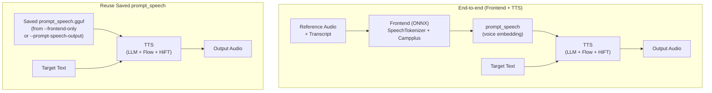

# CosyVoice.cpp

[](LICENSE)
[]()
[](https://github.com/Lourdle/cosyvoice.cpp/releases)
[](https://github.com/Lourdle/cosyvoice.cpp/actions/workflows/build-release.yml)

Language: English | [简体中文](README_zh.md)

> Unofficial project notice: this repository is **not** affiliated with, endorsed by, or maintained by the official CosyVoice team. It is a community-maintained C++/GGML port created by an independent developer.

> **Current status notice:** CPU, CUDA, Metal, and SYCL backends are currently working. The Vulkan backend currently fails to execute properly. Please review [Backend Test Status](#backend-test-status) before production use.

C++/GGML port of the Python CosyVoice inference pipeline released by the original CosyVoice project, currently focused on **CosyVoice3**.

This repository ships independent engineering work and does not contain official support commitments.

This project provides:
- A core C/C++ inference library (`cosyvoice`)
- A CLI synthesis tool (`cosyvoice-cli`)
- An OpenAI Speech-compatible API server (`cosyvoice-server`)
- A GGUF quantization tool (`quantize`)

## Contents
- [Features](#features)
- [Pre-converted Models](#pre-converted-models)
- [Documentation](#documentation)
- [AI Usage Disclosure](#ai-usage-disclosure)
- [Quick Start](#quick-start)
- [Inference Pipeline](#inference-pipeline)
- [Build](#build)
- [Dependency Resolution](#dependency-resolution)
- [CMake Options](#cmake-options)
- [Build Matrix (Typical)](#build-matrix-typical)
- [GGML Backend/Build Options](#ggml-backendbuild-options)
- [Using Custom Dependencies](#using-custom-dependencies)
- [Model Conversion to GGUF](#model-conversion-to-gguf)
- [Tooling Guide](#tooling-guide)
- [Backend Test Status](#backend-test-status)
- [Troubleshooting](#troubleshooting)
- [Third-Party Notices](#third-party-notices)
- [Licensing](#licensing)
- [Contributing](#contributing)

## Features

| Feature | Description |
|---|---|
| **OpenAI Speech API Server** | Drop-in compatible `POST /v1/audio/speech` endpoint with multi-voice, auth, and CORS support |
| **Interactive REPL** | CLI interactive mode with slash commands for play, save, list, query, and seed control |
| **Concurrent Serving** | Server `--concurrency` for parallel request handling |
| **Model Quantization** | Quantize GGUF models to smaller formats (Q2_K through F16) with the built-in `quantize` tool |
| **KV Cache Quantization** | Reduce LLM memory usage via `--llm-kv-cache-type` (f32 / f16 / q8_0 / q5_1 / q4_0 / ...) |
| **Prompt Speech Reuse** | Pre-encode reference voice once, reuse across multiple synthesis runs — no ONNX overhead |
| **Audio Backend Plugins** | Choose MINIAUDIO (default) or FFMPEG for multi-format encoding (WAV, MP3, AAC, FLAC, OPUS, M4A) |
| **UMA Auto-Detection** | Automatically detects unified memory architecture and adjusts buffer policy for optimal throughput |
| **Inference Buffer Policies** | `shared` / `balanced` / `dedicated` buffer modes to trade off memory vs. throughput |
| **Text Splitting & Fade-in** | Smart text splitting for long inputs and configurable output fade-in postprocessing |
| **Multiple Backends** | CPU, CUDA, Metal, SYCL (see [Backend Test Status](#backend-test-status)) |
| **Cross-Platform** | Windows (x64), Linux (x86_64), macOS (arm64) — all tested in CI |

## Pre-converted Models

Download ready-to-use GGUF models (no conversion needed):

- **ModelScope**: <https://modelscope.cn/models/Lourdle/Fun-CosyVoice3-0.5B-2512-GGUF>
- **Hugging Face**: <https://huggingface.co/Lourdle/Fun-CosyVoice3-0.5B-2512-GGUF>

Pre-quantized variants (Q2_K through F16) are available at the links above.

## Documentation
- API index: [docs/API.md](docs/API.md)
- Tooling guide: [docs/TOOLS.md](docs/TOOLS.md)
- Android build guide: [docs/build-android.md](docs/build-android.md)

## AI Usage Disclosure
- Most core library code is written by the author.
- Most tooling (cli, quantize, server) and documentation content is drafted and edited with AI assistance.
- Small mistakes or implementation drift may still exist; when in doubt, treat source code and header files as the ground truth, and feel free to open an issue or PR.

## Third-Party Notices
- See [THIRD_PARTY_NOTICES.md](THIRD_PARTY_NOTICES.md) for bundled dependency license details.
- FFT implementation (`src/fft.cpp`) references/adapts KissFFT (BSD-3-Clause) with project-specific SIMD optimizations; see [THIRD_PARTY_NOTICES.md](THIRD_PARTY_NOTICES.md).
- Tokenizer implementation is adapted from llama.cpp (MIT).

## Licensing
- **Repository code**: MIT (`LICENSE`).
- **Upstream reference**: the original CosyVoice project code and models are under Apache-2.0.
- **Implementation note**: this repository is an independent C++/GGML re-implementation based on model architecture and inference behavior, and is not an official fork or release.
- **GGUF model artifacts**: published model files remain under Apache-2.0. See [Pre-converted Models](#pre-converted-models) for download links.
- **Model license file**: [MODEL_LICENSE.md](MODEL_LICENSE.md)

## Quick Start

See [docs/TOOLS.md](docs/TOOLS.md) for detailed usage of all tools (`cosyvoice-cli`, `cosyvoice-server`, `quantize`).

### Pre-built Releases

The releases provided in this repository do not bundle the GGML backend libraries. To use them:
1. Download `cosyvoice-cli` or `cosyvoice-server` from this repository's [Releases page](https://github.com/Lourdle/cosyvoice.cpp/releases).
2. Download a `llama.cpp` release that matches your hardware and OS.
3. Place the `cosyvoice` executables into the same directory as the GGML backend shared libraries (`ggml.dll`, `ggml-cuda.dll`, etc.).
4. Run from that directory.

> **Known issue with pre-built GGML CUDA backend (Issue [#15](https://github.com/Lourdle/cosyvoice.cpp/issues/15)):** Some users have reported noise in generated audio when using pre-built GGML binaries from `llama.cpp` releases with the CUDA backend. I testing confirmed this issue with pre-compiled GGML CUDA builds, while self-compiled GGML from source did not exhibit the problem. If you encounter noise when using the CUDA backend with pre-built GGML, we recommend building both this project and GGML from source as a workaround. Refer to the [Build](#build) section for instructions.

### Build from Source

```bash
cmake -S . -B build -DCMAKE_BUILD_TYPE=Release
cmake --build build --config Release
```

Outputs in `build/bin` (executables) and `build/lib` (libraries). See [Build](#build) for detailed options.

## Inference Pipeline

This project supports two equivalent inference paths:



- **Path 1 (end-to-end)**: Frontend extracts `prompt_speech` from reference audio + transcript, then TTS synthesizes with target text.
  - `zero-shot` mode requires `--prompt-text`; `instruct` and `cross-lingual` modes ignore it.
- **Path 2 (reuse)**: Run frontend once via `--frontend-only` / `--prompt-speech-output`, then skip it for all subsequent synthesis. This avoids re-running the ONNX model each time.

## Build

### Requirements
- CMake >= 3.24
- C/C++ toolchain with C++20 support
- Git (used to fetch GGML automatically when missing)
- x86 CPU with AVX2 support is currently required for parts of the CPU data path
- For CPU math-heavy paths (for example `log` and trigonometric functions), SIMD acceleration is currently enabled only in MSVC builds; other toolchains currently fall back to scalar implementations

Backend/runtime requirements depend on your build options (CUDA/Vulkan/CPU, ONNX Runtime, ICU, etc.).

### 1) Configure
```bash
cmake -S . -B build -DCMAKE_BUILD_TYPE=Release
```

### 2) Build
```bash
cmake --build build --config Release
```

Build outputs are placed in:
- `build/bin` (executables/runtime DLLs)
- `build/lib` (libraries)

## Dependency Resolution
The top-level CMake project resolves dependencies in this order:

- **PCRE2**
  - Built from `vendor/pcre2` as static libraries (`pcre2-8`, `pcre2-16`).
- **GGML**
  - Uses `GGML_SOURCE_DIR` (default: `vendor/ggml`).
  - If missing, CMake clones `https://github.com/ggml-org/ggml.git` automatically.
- **ICU** (used by text normalization unless disabled with `COSYVOICE_NO_ICU`)
  - Resolution order: `ICU_PREBUILT_DIR` -> `find_package(ICU)` -> Windows auto-download -> system ICU on Linux/macOS.
- **ONNX Runtime** (used by the frontend unless disabled with `COSYVOICE_NO_FRONTEND`)
  - Resolution order: `ORT_PREBUILT_DIR` -> `find_package(onnxruntime)` -> auto-download.

Useful cache variables:
- `GGML_SOURCE_DIR`
- `ICU_PREBUILT_DIR`
- `ORT_PREBUILT_DIR`

Default values:
- `GGML_SOURCE_DIR=vendor/ggml`
- `ICU_PREBUILT_DIR=<build_dir>/_deps/icu`
- `ORT_PREBUILT_DIR=<build_dir>/_deps/onnxruntime`

Notes:
- If `GGML_SOURCE_DIR` does not contain GGML sources, CMake will try to clone GGML.
- If ICU/ONNX Runtime are not found by `find_package`, CMake will use or download prebuilt binaries into the configured prebuilt directories.
- On Windows, prebuilt dependency DLLs are copied next to built executables.

## Audio backend & FFmpeg

This project supports two audio backends for encoding/decoding helper APIs:

- `MINIAUDIO` (default): provides WAV I/O and basic PCM helpers.
- `FFMPEG` (optional): enables encoding/decoding for additional formats when the linked FFmpeg runtime provides the required encoders.

Control the audio backend via CMake: set `COSYVOICE_AUDIO_BACKEND` to `MINIAUDIO` or `FFMPEG`.
Default: `MINIAUDIO`.

Examples:
```bash
cmake -S . -B build -DCOSYVOICE_AUDIO_BACKEND=MINIAUDIO
cmake -S . -B build -DCOSYVOICE_AUDIO_BACKEND=FFMPEG
cmake -S . -B build -DCOSYVOICE_AUDIO_BACKEND=FFMPEG -DFFMPEG_PREBUILT_DIR=/path/to/ffmpeg
```

If you build with FFmpeg support, the public audio API keeps the same function names. Use `cosyvoice_audio_supported_encoding_formats()` to query the actual formats available in the linked FFmpeg runtime.

FFmpeg usage notes:

- On Windows the build scripts download prebuilt FFmpeg (BtbN builds) by default when `FFMPEG_PREBUILT_DIR` is not provided.
- On Linux/macOS the system-provided FFmpeg (homebrew/apt) will be used when available; otherwise point `FFMPEG_PREBUILT_DIR` to your prebuilt location.
- The API surface includes `wav`, `mp3`, `aac`, `flac`, `m4a`, and `opus`, but the usable subset depends on the linked FFmpeg build. The library probes available encoders at runtime and exposes the supported set via the API and CLI/server help messages.
- `m4a` is a non-standard convenience extension here. OpenAI Speech does not define it; use `response_format` only if your client/server understands this project-specific extension.
- If a requested format is not supported at runtime, the server/CLI will instruct you to use `wav` or `pcm` instead.
- On Windows, the build will copy the FFmpeg runtime DLLs it found into the executable directory. If you use a custom prebuilt FFmpeg, make sure the `bin` and `lib` layout matches the expectations in `cmake/Dependencies.cmake`.

License reminder:

- The repository code is MIT. FFmpeg prebuilt binaries may be LGPL or GPL depending on build options. Using a GPL-enabled FFmpeg build may impose GPL obligations on your redistributed binaries. See [FFmpeg-NOTICE.md](FFmpeg-NOTICE.md).

## CMake Options
Project-level options:
- `BUILD_SHARED_LIBS=ON/OFF` (default: `ON`)
- `COSYVOICE_NO_AUDIO=ON/OFF` (default: `OFF`)
- `COSYVOICE_NO_FRONTEND=ON/OFF` (default: `OFF`)
- `COSYVOICE_NO_ICU=ON/OFF` (default: `OFF`)
- `COSYVOICE_CLI_NO_PLAYBACK=ON/OFF` (default: unset, follows `COSYVOICE_NO_AUDIO`)
- `COSYVOICE_AUDIO_BACKEND=MINIAUDIO/FFMPEG` (default: `MINIAUDIO`)

Dependency path options:
- `GGML_SOURCE_DIR=<path>`
- `ICU_PREBUILT_DIR=<path>`
- `ORT_PREBUILT_DIR=<path>`
- `FFMPEG_PREBUILT_DIR=<path>`
- `SIMDE_INCLUDE_DIR=<path>` (required on ARM64/aarch64, including Android cross-compilation)

GGML backend options are passed through from GGML CMake (for example `GGML_CUDA`, `GGML_VULKAN`, etc.).

## Build Matrix (Typical)
| Scenario | Recommended CMake flags |
|---|---|
| CUDA backend | `-DGGML_CUDA=ON` |
| Vulkan backend | `-DGGML_VULKAN=ON` |
| CPU-only | no backend flag required |
| Core-only (no frontend / ICU) | `-DCOSYVOICE_NO_FRONTEND=ON -DCOSYVOICE_NO_ICU=ON` |
| No-audio helper API | `-DCOSYVOICE_NO_AUDIO=ON` |
| Disable CLI playback | `-DCOSYVOICE_CLI_NO_PLAYBACK=ON` |

## GGML Backend/Build Options
This project vendors/uses GGML through CMake, so GGML backend switches can be passed from this root build.

Typical examples (refer to `llama.cpp` / GGML [docs](https://github.com/ggml-org/llama.cpp/blob/master/docs/build.md) for backend-specific options and recommended settings):
```bash
# CUDA example
cmake -S . -B build-cuda -DGGML_CUDA=ON
```

Project options:
- `COSYVOICE_NO_AUDIO=ON/OFF` (disable/enable audio helper APIs)
- `COSYVOICE_CLI_NO_PLAYBACK=ON/OFF` (disable/enable CLI playback; if unset, follows `COSYVOICE_NO_AUDIO`)
- `COSYVOICE_NO_FRONTEND=ON/OFF` (disable/enable ONNX frontend)
- `COSYVOICE_NO_ICU=ON/OFF` (disable/enable ICU text normalization)
- `BUILD_SHARED_LIBS=ON/OFF`

Practical combinations:
```bash
# Core-only build (no ONNX frontend, no ICU text norm)
cmake -S . -B build-core -DCMAKE_BUILD_TYPE=Release -DCOSYVOICE_NO_FRONTEND=ON -DCOSYVOICE_NO_ICU=ON

# No-audio build (CLI output forced to WAV fallback path)
cmake -S . -B build-noaudio -DCMAKE_BUILD_TYPE=Release -DCOSYVOICE_NO_AUDIO=ON

# Disable CLI playback (audio helper APIs still available)
cmake -S . -B build-noplay -DCMAKE_BUILD_TYPE=Release -DCOSYVOICE_CLI_NO_PLAYBACK=ON
```

## Using Custom Dependencies
You can point CMake to custom dependency locations with cache variables:

```bash
cmake -S . -B build \
  -DGGML_SOURCE_DIR=/path/to/ggml \
  -DICU_PREBUILT_DIR=/path/to/icu \
  -DORT_PREBUILT_DIR=/path/to/onnxruntime \
  -DSIMDE_INCLUDE_DIR=/path/to/simde
```

You can also use the default prebuilt locations under your build directory:
- `<build_dir>/_deps/icu`
- `<build_dir>/_deps/onnxruntime`

If you place files there with the expected layout, CMake will pick them up automatically (without extra `-D` flags).

Expected markers/layout:
- ICU: `include/unicode/utypes.h` (and platform libs/dlls under `lib*` / `bin*`)
- ONNX Runtime: `include/onnxruntime_c_api.h` and runtime library files under `lib`

Notes:
- If `GGML_SOURCE_DIR` does not contain GGML sources, CMake will try to clone GGML.
- If ICU/ONNX Runtime are not found by `find_package`, CMake will use/download prebuilt binaries into the configured prebuilt directories.
- On Windows, prebuilt DLLs are copied next to built executables for local running.

## Model Conversion to GGUF
Use this repository's conversion script (`convert_model_to_gguf.py`) to convert upstream CosyVoice model weights to GGUF for `cosyvoice.cpp`.

Install Python dependencies first:
```bash
pip install -r requirements.txt
```

Minimal usage:
```bash
python convert_model_to_gguf.py \
  --yaml_config /path/to/cosyvoice.yaml \
  --ftype f16 \
  --gguf_model /path/to/CosyVoice3-2512_F16.gguf
```

Full example:
```bash
python convert_model_to_gguf.py \
  --yaml_config /path/to/cosyvoice.yaml \
  --llm_model /path/to/llm.pt \
  --blank_llm /path/to/CosyVoice-BlankEN \
  --flow_model /path/to/flow.pt \
  --hift_model /path/to/hift.pt \
  --gguf_model /path/to/CosyVoice3-2512_Q8_0.gguf \
  --ftype q8_0 \
  --tag 2512
```

`--ftype` options:
- `default`, `f32`, `f16`, `q8_0`, `q5_0`, `q5_1`, `q4_0`, `q4_1`

Default path behavior (when not explicitly provided):
- `--llm_model` -> `<yaml_dir>/llm.pt`
- `--blank_llm` -> `<yaml_dir>/CosyVoice-BlankEN`
- `--flow_model` -> `<yaml_dir>/flow.pt`
- `--hift_model` -> `<yaml_dir>/hift.pt`

After conversion:
1. Verify the generated `.gguf` file.
2. (Optional) Quantize it with this repository's `quantize` tool.

## Tooling Guide
This repository includes three user-facing tools:
- `cosyvoice-cli`: local file-based TTS generation (supports prompt_speech reuse and frontend + TTS flow).
- `cosyvoice-server`: OpenAI Speech-compatible HTTP API server for service-style integration.
- `quantize`: GGUF quantization utility to convert model files to smaller/faster formats. Supports per-tensor quantization type mapping via PCRE2 regex patterns (`-M/--tensor-map`). Pre-built profiles for CosyVoice3-2512 are available under `tools/quantize/profiles/`.

Full commands, options, and examples are documented in:
- [docs/TOOLS.md](docs/TOOLS.md)

## Backend Test Status
Current backend test results are as follows:

| Backend | Status | Notes |
|---|---:|---|
| CPU | Working | Thanks to @[jasagiri](https://github.com/jasagiri) for helping identify the issue. Tested on Windows, Linux, and Mac. |
| CUDA | Working | Tested on Ada Lovelace GPUs (Windows & Linux). |
| Metal | Working | Thanks to @[jasagiri](https://github.com/jasagiri) for his help and code contributions. |
| SYCL | Working | Verified on the Intel Raptor Lake integrated GPU on Windows 11 x64. |
| Vulkan | Not working | Currently cannot run normally. |
| OpenCL | Working | Verified on Android 16, Qualcomm Snapdragon 8 Elite. Many ops are missing and fall back to CPU; frequent GPU-CPU context switching overhead results in no significant speedup over CPU. |
| Others | Untested | |

## Troubleshooting
- CMake cannot find GGML: set `-DGGML_SOURCE_DIR=...` or keep default `vendor/ggml` and ensure Git is available for auto-clone.
- ICU/ONNX Runtime detection issues: either install system packages (where applicable) or place prebuilt files into `<build_dir>/_deps/icu` and `<build_dir>/_deps/onnxruntime`.
- Executable starts but misses runtime libraries on Windows: ensure post-build copied DLLs exist next to binaries in `build/bin`.
- Backend-specific issues are summarized in [Backend Test Status](#backend-test-status).

## Contributing
Contributions are welcome.

Please feel free to open issues or submit pull requests for:
- Backend stability fixes
- Cross-platform correctness improvements
- Performance and memory optimizations
- Documentation/tooling improvements

If the root cause is in GGML, please submit fixes/patches upstream to GGML.
