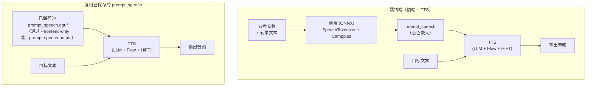

# CosyVoice.cpp

[](LICENSE)
[]()
[](https://github.com/Lourdle/cosyvoice.cpp/releases)
[](https://github.com/Lourdle/cosyvoice.cpp/actions/workflows/build-release.yml)

语言： [English](README.md) | 简体中文

> 非官方说明：本仓库**与 CosyVoice 官方团队无隶属关系**，也未获得官方背书或维护。本项目是社区开发者发起和维护的 C++/GGML 移植实现。

> **当前状态提示：** 当前 CPU、CUDA、Metal 和 SYCL 后端均可正常运行。Vulkan 后端目前无法正常工作。用于生产前请先阅读[后端测试情况](#后端测试情况)。

本项目将原始 CosyVoice 项目发布的 Python 推理流程迁移到 C++/GGML，目前主要支持 **CosyVoice3**。

本仓库仅提供独立社区实现，不包含任何官方支持承诺。

本项目提供：
- 核心 C/C++ 推理库（`cosyvoice`）
- 命令行合成工具（`cosyvoice-cli`）
- OpenAI Speech 兼容 API 服务，含嵌入式 WebUI（`cosyvoice-server`）
- GGUF 量化工具（`quantize`）

## 目录
- [功能特性](#功能特性)
- [预转换模型](#预转换模型)
- [文档](#文档)
- [AI 使用说明](#ai-使用说明)
- [快速开始](#快速开始)
- [推理流程](#推理流程)
- [构建](#构建)
- [依赖解析方式](#依赖解析方式)
- [CMake 选项](#cmake-选项)
- [常见构建矩阵](#常见构建矩阵)
- [GGML 后端/构建选项](#ggml-后端构建选项)
- [使用自定义依赖](#使用自定义依赖)
- [模型转 GGUF](#模型转-gguf)
- [工具使用说明](#工具使用说明)
- [后端测试情况](#后端测试情况)
- [故障排查](#故障排查)
- [第三方许可说明](#第三方许可说明)
- [许可证说明](#许可证说明)
- [欢迎贡献](#欢迎贡献)

## 功能特性

| 特性 | 说明 |
|---|---|
| **OpenAI Speech API 服务** | 即插即用的 `POST /v1/audio/speech` 端点，支持多音色、鉴权和 CORS——内置 **WebUI** 用于模型/音色管理和 TTS 生成 |
| **WebUI 仪表盘** | 现代化浏览器界面，支持运行时加载/卸载模型、注册音色（GGUF 导入/音频提取/麦克风录音）、TTS 生成（实时播放、历史记录、完整采样控制） |
| **交互式 REPL** | CLI 交互模式，支持 /play、/save、/list、/query、/seed 等斜杠命令 |
| **并发服务** | Server 的 `--concurrency` 参数，支持并行请求处理 |
| **模型量化** | 内置 `quantize` 工具，支持 Q2_K 到 F16 多种量化格式 |
| **KV Cache 量化** | 通过 `--llm-kv-cache-type` 降低 LLM 内存占用（f32 / f16 / q8_0 / q5_1 / q4_0 / ...）。支持非对称量化，K 和 V 可独立指定类型（如 `k=q8_0,v=q4_0`）。 |
| **Prompt Speech 复用** | 一次编码参考音色，后续合成直接复用，无需再跑 ONNX |
| **音频后端可切换** | 可选 MINIAUDIO（默认）或 FFMPEG，支持 WAV、MP3、AAC、FLAC、OPUS、M4A |
| **UMA 自动检测** | 自动检测统一内存架构并调整 buffer policy，优化吞吐 |
| **推理 Buffer 策略** | `shared` / `balanced` / `dedicated` 三种模式，权衡内存与吞吐 |
| **文本拆分与淡入** | 长文本智能拆分与可配置的输出淡入后处理 |
| **多后端支持** | CPU、CUDA、Metal、SYCL（见[后端测试情况](#后端测试情况)） |
| **跨平台** | Windows (x64)、Linux (x86_64)、macOS (arm64) — 均在 CI 中测试 |

## 预转换模型

下载即用的 GGUF 模型（无需自行转换）：

- **ModelScope**：<https://modelscope.cn/models/Lourdle/Fun-CosyVoice3-0.5B-2512-GGUF>
- **Hugging Face**：<https://huggingface.co/Lourdle/Fun-CosyVoice3-0.5B-2512-GGUF>

上述链接包含 Q2_K 到 F16 的多种量化变体。

## 文档
- API 索引：[docs/API_zh.md](docs/API_zh.md)
- 工具说明：[docs/TOOLS_zh.md](docs/TOOLS_zh.md)
- Android 构建指南：[docs/build-android_zh.md](docs/build-android_zh.md)

## AI 使用说明
- 核心库代码主要由作者手工实现。
- 工具（cli、quantize、server）和文档内容大多由 AI 协助撰写与整理。
- 仍可能存在少量错误或与实现不同步的情况；如有疑问请以源码与头文件为准，也欢迎提交 Issue/PR 纠正。

## 第三方许可说明
- 已打包依赖的许可证信息见 [THIRD_PARTY_NOTICES.md](THIRD_PARTY_NOTICES.md)。
- FFT 实现（`src/fft.cpp`）参考/改造自 KissFFT（BSD-3-Clause），并加入了项目内 SIMD 优化；详见 [THIRD_PARTY_NOTICES.md](THIRD_PARTY_NOTICES.md)。
- tokenizer 实现基于 llama.cpp（MIT）改造。

## 许可证说明
- **本仓库代码**：MIT（见 `LICENSE`）。
- **上游参考**：原始 CosyVoice 项目代码与模型为 Apache-2.0。
- **实现说明**：本仓库是基于模型架构与推理行为的独立 C++/GGML 重实现，并非官方 fork 或官方发布。
- **GGUF 模型产物**：发布的模型文件继续保持 Apache-2.0。下载链接见[预转换模型](#预转换模型)。
- **模型许可证文件**：[MODEL_LICENSE.md](MODEL_LICENSE.md)

## 快速开始

各工具（`cosyvoice-cli`、`cosyvoice-server`、`quantize`）的详细用法见 [docs/TOOLS_zh.md](docs/TOOLS_zh.md)。

### 预编译发布版 (Releases)

本仓库提供的 Releases 不包含 GGML 后端库：
1. 从本仓库的 [Releases 页面](https://github.com/Lourdle/cosyvoice.cpp/releases) 下载 `cosyvoice-cli` 或 `cosyvoice-server`。
2. 下载与硬件和操作系统匹配的 `llama.cpp` release。
3. 将 `cosyvoice` 可执行文件放到包含 GGML 后端共享库（`ggml.dll`、`ggml-cuda.dll` 等）的同一目录。
4. 在该目录下运行。

> **预编译 GGML CUDA 后端已知问题（Issue [#15](https://github.com/Lourdle/cosyvoice.cpp/issues/15)）：** 有用户反馈使用 `llama.cpp` 预编译发布版的 GGML CUDA 后端时，生成的音频存在噪音。我测试确认了预编译 GGML CUDA 版本存在此问题，而自行从源码编译的 GGML 则未出现该问题。如果您在使用 CUDA 后端配合预编译 GGML 时遇到噪音，建议参考本文[构建](#构建)章节，将本项目与 GGML 一同从源码编译。

### 从源码构建

> **Server 构建要求（非 Windows 平台）：** 在 Linux/macOS 上编译 `cosyvoice-server` 需要
> 两项额外的工具链能力——**C 编译器**需支持 C23（GCC 15+ 或 Clang 19+）用于嵌入 WebUI 资源，
> **Ninja** 生成器（1.11+）配合较新的 C++ 编译器（GCC 14+ / Clang 16+ / AppleClang 16+）
> 用于 C++20 模块扫描（不支持时自动回退 PCH）。Windows 使用默认的 Visual Studio 工具链即可
> 覆盖两者。详见[构建](#构建)章节。

```bash
cmake -S . -B build -DCMAKE_BUILD_TYPE=Release
cmake --build build --config Release
```

构建产物在 `build/bin`（可执行文件）和 `build/lib`（库文件）。详细构建选项见[构建](#构建)。

## 推理流程

本项目支持两条等价推理路径：



- **路径 1（端到端）**：前端从参考音频 + 转录文本提取 `prompt_speech`，然后 TTS 与目标文本合成语音。
  - `zero-shot` 模式需要 `--prompt-text`；`instruct` / `cross-lingual` 模式忽略它。
- **路径 2（复用）**：通过 `--frontend-only` / `--prompt-speech-output` 运行一次前端，后续合成跳过 ONNX 模型。适合批量/重复合成。

## 构建

### 环境要求
- CMake >= 3.24
- 支持 C++20 的 C/C++ 编译器
- Git（当本地缺少 GGML 源码时用于自动拉取）
- 目前 CPU 路径中的部分数据处理要求 x86 CPU 支持 AVX2
- 对 CPU 侧数学运算较重的路径（如 `log`、三角函数），当前仅 MSVC 构建可启用 SIMD 加速；其他工具链目前回退为标量实现

> **Server 构建须知（非 Windows 平台）：** 在 Linux/macOS 上编译 `cosyvoice-server` 需要在以下
> 两方面额外留意：
>
> **1. C23 `#embed` 嵌入 WebUI 资源**
> `resource_embed.c` 通过 C23 `#embed` 指令将 WebUI（HTML/CSS/JS）打包到可执行文件中，
> 因此需要 **C 编译器**支持 C23——即 GCC 15+ 或 Clang 19+。Windows 通过原生 RC 工具嵌入
> 资源，无需特殊编译器。
>
> 示例——指定支持 C23 的 C 编译器：
> ```bash
> # Ubuntu/Debian — 用 clang-20 作为 C 编译器
> sudo apt install clang-20
> cmake -B build -DCMAKE_C_COMPILER=clang-20 -DCMAKE_BUILD_TYPE=Release
> cmake --build build --config Release
> ```
>
> **2. C++20 模块**
> 服务端使用了 C++20 模块接口（`.ixx` 文件封装 nlohmann-json 和 cpp-httplib）。
> **建议**使用 **Ninja** 生成器（1.11+）配合较新的 C++ 编译器（GCC 14+ / Clang 16+ /
> AppleClang 16+ / MSVC 14.34+）以获得完整的模块扫描支持：
> - 在 cmake 配置时添加 `-G Ninja`。
> - Windows：Visual Studio 生成器完整支持模块扫描——无需额外参数。
> - 不支持的生成器或旧版编译器：CMake 会自动检测并**回退到预编译头（PCH）**。
>
> Linux/macOS 推荐配置：
> ```bash
> cmake -B build -G Ninja -DCMAKE_BUILD_TYPE=Release
> cmake --build build --config Release
> ```

后端/运行时依赖会随构建选项变化（CUDA/Vulkan/CPU、ONNX Runtime、ICU 等）。

### 1）配置
```bash
cmake -S . -B build -DCMAKE_BUILD_TYPE=Release
```

### 2）编译
```bash
cmake --build build --config Release
```

构建产物默认输出到：
- `build/bin`（可执行文件与运行时 DLL）
- `build/lib`（库文件）

## 依赖解析方式
顶层 CMake 按以下顺序解析依赖：

- **PCRE2**
  - 从 `vendor/pcre2` 构建静态库（`pcre2-8`、`pcre2-16`）。
- **GGML**
  - 使用 `GGML_SOURCE_DIR`（默认 `vendor/ggml`）。
  - 若目录不存在，会自动克隆 `https://github.com/ggml-org/ggml.git`。
- **ICU**（用于文本规范化，除非通过 `COSYVOICE_NO_ICU` 关闭）
  - 解析顺序：`ICU_PREBUILT_DIR` -> `find_package(ICU)` -> Windows 自动下载 -> Linux/macOS 使用系统 ICU。
- **ONNX Runtime**（用于前端，除非通过 `COSYVOICE_NO_FRONTEND` 关闭）
  - 解析顺序：`ORT_PREBUILT_DIR` -> `find_package(onnxruntime)` -> 自动下载。

常用缓存变量：
- `GGML_SOURCE_DIR`
- `ICU_PREBUILT_DIR`
- `ORT_PREBUILT_DIR`

默认值：
- `GGML_SOURCE_DIR=vendor/ggml`
- `ICU_PREBUILT_DIR=<build_dir>/_deps/icu`
- `ORT_PREBUILT_DIR=<build_dir>/_deps/onnxruntime`

说明：
- 如果 `GGML_SOURCE_DIR` 下没有 GGML 源码，CMake 会尝试自动克隆 GGML。
- 如果 ICU/ONNX Runtime 未被 `find_package` 找到，CMake 会在配置的预编译目录中使用或下载对应二进制。
- Windows 下预编译依赖 DLL 会复制到可执行文件旁。

## 音频后端与 FFmpeg

本项目的音频辅助 API 支持两种后端：

- `MINIAUDIO`（默认）：提供 WAV I/O 与基本 PCM 帮助函数。
- `FFMPEG`（可选）：在链接的 FFmpeg 运行时提供所需编码器时，启用更多编码/解码格式。

通过 CMake 配置音频后端：将 `COSYVOICE_AUDIO_BACKEND` 设为 `MINIAUDIO` 或 `FFMPEG`。
默认值为 `MINIAUDIO`。

示例：
```bash
cmake -S . -B build -DCOSYVOICE_AUDIO_BACKEND=MINIAUDIO
cmake -S . -B build -DCOSYVOICE_AUDIO_BACKEND=FFMPEG
cmake -S . -B build -DCOSYVOICE_AUDIO_BACKEND=FFMPEG -DFFMPEG_PREBUILT_DIR=/path/to/ffmpeg
```

如果启用 FFmpeg 支持，公开音频 API 的函数名保持不变。可使用 `cosyvoice_audio_supported_encoding_formats()` 查询当前链接的 FFmpeg 运行时真正支持哪些格式。

FFmpeg 使用要点：

- 在 Windows 上，构建脚本默认在未提供 `FFMPEG_PREBUILT_DIR` 时下载 BtbN 的预编译 FFmpeg。
- 在 Linux/macOS 上，若系统提供 FFmpeg（apt/homebrew），项目会优先使用系统库；否则可通过 `FFMPEG_PREBUILT_DIR` 指定预编译位置。
- API 层支持 `wav`、`mp3`、`aac`、`flac`、`m4a`、`opus`，但具体可用格式取决于当前链接的 FFmpeg 构建。库会在运行时探测可用编码器，并通过 API / CLI / server 帮助文本暴露支持集合。
- `m4a` 是这里提供的非标准便捷扩展。OpenAI Speech 标准并没有定义 `m4a`，只在你的客户端/服务端理解这个扩展时使用。
- 如果客户端请求了运行时不可用的格式，服务/CLI 会建议回退到 `wav` 或 `pcm`。
- 在 Windows 上，构建脚本会把找到的 FFmpeg 运行时 DLL 复制到可执行文件目录。若你使用自定义预编译 FFmpeg，请确认其 `bin` / `lib` 目录结构符合 `cmake/Dependencies.cmake` 的预期。

许可证提醒：

- 本仓库代码采用 MIT 许可。FFmpeg 预编译包可能是 LGPL 或 GPL，取决于编译选项。使用包含 GPL 编码器的 FFmpeg 构建并重新分发时，可能会对你的发行物带来 GPL 约束。详见 [FFmpeg-NOTICE.md](FFmpeg-NOTICE.md)。

## CMake 选项
项目级选项：
- `BUILD_SHARED_LIBS=ON/OFF`（默认：`ON`）
- `COSYVOICE_NO_AUDIO=ON/OFF`（默认：`OFF`）
- `COSYVOICE_NO_FRONTEND=ON/OFF`（默认：`OFF`）
- `COSYVOICE_NO_ICU=ON/OFF`（默认：`OFF`）
- `COSYVOICE_CLI_NO_PLAYBACK=ON/OFF`（默认：未设置，跟随 `COSYVOICE_NO_AUDIO`）
- `COSYVOICE_AUDIO_BACKEND=MINIAUDIO/FFMPEG`（默认：`MINIAUDIO`）

依赖路径选项：
- `GGML_SOURCE_DIR=<path>`
- `ICU_PREBUILT_DIR=<path>`
- `ORT_PREBUILT_DIR=<path>`
- `FFMPEG_PREBUILT_DIR=<path>`
- `SIMDE_INCLUDE_DIR=<path>`（ARM64/aarch64 交叉编译时必需，包括 Android）

GGML 后端相关选项可直接透传（例如 `GGML_CUDA`、`GGML_VULKAN` 等）。

## 常见构建矩阵
| 场景 | 推荐 CMake 参数 |
|---|---|
| CUDA 后端 | `-DGGML_CUDA=ON` |
| Vulkan 后端 | `-DGGML_VULKAN=ON` |
| 仅 CPU | 通常不需要额外后端参数 |
| 仅核心能力（无 frontend / ICU） | `-DCOSYVOICE_NO_FRONTEND=ON -DCOSYVOICE_NO_ICU=ON` |
| 关闭音频辅助 API | `-DCOSYVOICE_NO_AUDIO=ON` |
| 关闭 CLI 播放功能 | `-DCOSYVOICE_CLI_NO_PLAYBACK=ON` |

## GGML 后端/构建选项
本项目通过 CMake 集成 GGML，可在根工程直接传入 GGML 后端开关。

常见示例（后端具体配置建议参考 `llama.cpp` / GGML [文档](https://github.com/ggml-org/llama.cpp/blob/master/docs/build.md)）：
```bash
# CUDA 示例
cmake -S . -B build-cuda -DGGML_CUDA=ON
```

项目选项：
- `COSYVOICE_NO_AUDIO=ON/OFF`（关闭/启用音频辅助 API）
- `COSYVOICE_CLI_NO_PLAYBACK=ON/OFF`（关闭/启用 CLI 播放；未设置时跟随 `COSYVOICE_NO_AUDIO`）
- `COSYVOICE_NO_FRONTEND=ON/OFF`（关闭/启用 ONNX 前端）
- `COSYVOICE_NO_ICU=ON/OFF`（关闭/启用 ICU 文本规范化）
- `BUILD_SHARED_LIBS=ON/OFF`

常见组合示例：
```bash
# 仅核心功能构建（关闭 ONNX 前端与 ICU 文本规范化）
cmake -S . -B build-core -DCOSYVOICE_NO_FRONTEND=ON -DCOSYVOICE_NO_ICU=ON

# 无音频辅助 API 构建（CLI 走 WAV 输出回退路径）
cmake -S . -B build-noaudio -DCOSYVOICE_NO_AUDIO=ON

# 关闭 CLI 播放功能（音频辅助 API 仍可用）
cmake -S . -B build-noplay -DCOSYVOICE_CLI_NO_PLAYBACK=ON
```

## 使用自定义依赖
可以通过缓存变量指定自定义依赖路径：

```bash
cmake -S . -B build \
  -DGGML_SOURCE_DIR=/path/to/ggml \
  -DICU_PREBUILT_DIR=/path/to/icu \
  -DORT_PREBUILT_DIR=/path/to/onnxruntime \
  -DSIMDE_INCLUDE_DIR=/path/to/simde
```

也可以直接使用构建目录下的默认预编译依赖位置：
- `<build_dir>/_deps/icu`
- `<build_dir>/_deps/onnxruntime`

只要按期望目录结构把文件放进去，CMake 会自动识别（不需要额外 `-D`）。

期望的关键目录/文件：
- ICU：`include/unicode/utypes.h`（以及 `lib*` / `bin*` 下的库和 DLL）
- ONNX Runtime：`include/onnxruntime_c_api.h`（以及 `lib` 下的运行库文件）

说明：
- 如果 `GGML_SOURCE_DIR` 下没有 GGML 源码，CMake 会尝试自动克隆 GGML。
- 如果 ICU/ONNX Runtime 未被 `find_package` 找到，CMake 会在配置的预编译目录中使用或下载对应二进制。
- Windows 下会在构建后将所需 DLL 复制到可执行文件目录，便于本地直接运行。

## 模型转 GGUF
可使用本仓库的转换脚本 `convert_model_to_gguf.py`，将上游 CosyVoice 模型权重转换为 `cosyvoice.cpp` 可用的 GGUF。

先安装 Python 依赖：
```bash
pip install -r requirements.txt
```

最小用法：
```bash
python convert_model_to_gguf.py \
  --yaml_config /path/to/cosyvoice.yaml \
  --ftype f16 \
  --gguf_model /path/to/CosyVoice3-2512_F16.gguf
```

完整参数示例：
```bash
python convert_model_to_gguf.py \
  --yaml_config /path/to/cosyvoice.yaml \
  --llm_model /path/to/llm.pt \
  --blank_llm /path/to/CosyVoice-BlankEN \
  --flow_model /path/to/flow.pt \
  --hift_model /path/to/hift.pt \
  --gguf_model /path/to/CosyVoice3-2512_Q8_0.gguf \
  --ftype q8_0 \
  --tag 2512
```

`--ftype` 可选值：
- `default`, `f32`, `f16`, `q8_0`, `q5_0`, `q5_1`, `q4_0`, `q4_1`

未显式传入时的默认路径规则：
- `--llm_model` -> `<yaml_dir>/llm.pt`
- `--blank_llm` -> `<yaml_dir>/CosyVoice-BlankEN`
- `--flow_model` -> `<yaml_dir>/flow.pt`
- `--hift_model` -> `<yaml_dir>/hift.pt`

转换后建议：
1. 先确认生成的 `.gguf` 文件可用。
2. （可选）再使用本仓库 `quantize` 工具量化。

## 工具使用说明
本仓库包含 3 个面向使用者的工具：
- `cosyvoice-cli`：本地文件式 TTS 合成（支持复用 prompt_speech，以及前端 + TTS 一体流程）。
- `cosyvoice-server`：OpenAI Speech 兼容 HTTP API 服务，适合服务化接入。
- `quantize`：GGUF 量化工具，用于将模型转换为更小/更快的量化格式。支持通过 PCRE2 正则逐 tensor 指定量化类型（`-M/--tensor-map`）。预置的 CosyVoice3-2512 profile 见 `tools/quantize/profiles/`。

完整命令、参数和示例见：
- [docs/TOOLS_zh.md](docs/TOOLS_zh.md)

## 后端测试情况
当前各后端测试结果如下：

| 后端 | 状态 | 备注 |
|---|---:|---|
| CPU | 可运行 | 感谢 @[jasagiri](https://github.com/jasagiri) 帮助定位问题。已在 Windows、Linux 和 Mac 上测试。 |
| CUDA | 可运行 | 已在 Ada Lovelace GPU (Windows & Linux) 上测试。 |
| Metal | 可运行 | 感谢 @[jasagiri](https://github.com/jasagiri) 的支持与代码贡献。 |
| SYCL | 可运行 | 已在 Windows 11 x64 上的 Intel Raptor Lake 集成显卡上验证。 |
| Vulkan | 不能运行 | 目前无法正常运行。 |
| OpenCL | 可运行 | 在 Android 16、Qualcomm Snapdragon 8 Elite 上验证通过。OpenCL 后端缺失大量算子，需卸载到 CPU 运行，频繁切换计算后端导致上下文开支较大，相比 CPU 并未带来显著提速。 |
| 其它 | 未测试 | |

## 故障排查
- CMake 找不到 GGML：设置 `-DGGML_SOURCE_DIR=...`，或使用默认 `vendor/ggml` 并确保本机可用 Git（用于自动克隆）。
- ICU/ONNX Runtime 检测失败：可安装系统包（适用平台），或将预编译文件放到 `<build_dir>/_deps/icu` 与 `<build_dir>/_deps/onnxruntime`。
- Windows 运行时缺库：检查 `build/bin` 下是否存在构建后复制的依赖 DLL。
- 后端相关情况见[后端测试情况](#后端测试情况)。

## 欢迎贡献
欢迎提交 Issue 和 Pull Request，尤其是：
- 后端稳定性修复
- 跨平台正确性改进
- 性能与内存优化
- 文档与工具改进

如果根因在 GGML，请优先向上游 GGML 提交修复补丁。
