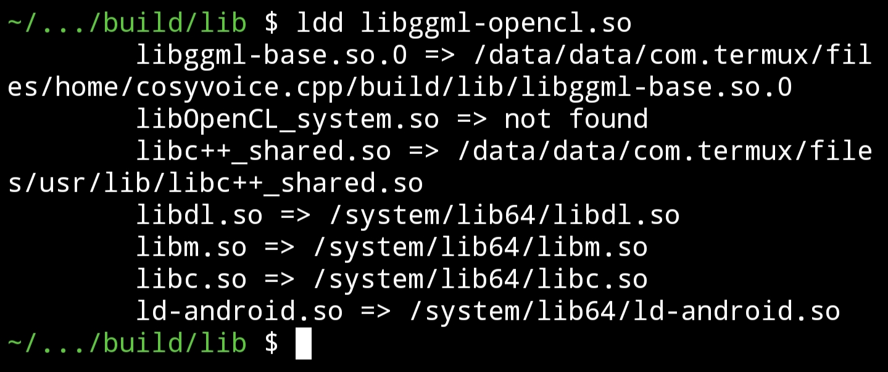
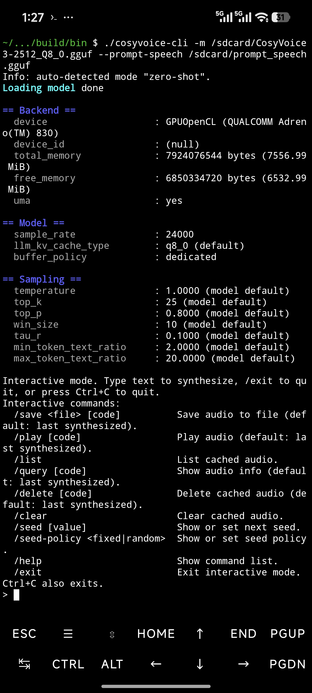

# Android Build Guide

## Termux (Build Directly on Device)

### Prerequisites

Install Termux on your Android device and open it. Install the required tools and libraries:

```bash
pkg update
apt install clang cmake make simde
```

For the FFmpeg backend, also run `apt install ffmpeg`. For ICU support, also run `apt install libicu`.

### CPU

Follow the standard configure and build flow from the README, but remember to add `-DCOSYVOICE_NO_FRONTEND=ON`. ONNX Runtime does not have Android prebuilt libraries; without this flag, CMake will automatically download the Linux version of ONNX Runtime.

### OpenCL

If you want to enable OpenCL in Termux, first prepare the OpenCL headers:

```bash
git clone https://github.com/KhronosGroup/OpenCL-Headers.git --depth=1
```

Then make sure the system OpenCL runtime is accessible. Android behavior changed across versions:

- Older Android may work with `/vendor/lib64/libOpenCL.so`
- Android 16 needs `/system_ext/lib64/libOpenCL_system.so`
- If `$PREFIX/lib/libOpenCL.so` already exists on Android 16, replace it with a symlink to `libOpenCL_system.so`

```bash
rm -f $PREFIX/lib/libOpenCL.so
ln -s /system_ext/lib64/libOpenCL_system.so $PREFIX/lib/libOpenCL.so
```

> This makes the linker resolve the target file name `libOpenCL_system.so` directly. On Android 16, `ggml-opencl` needs to point at that name via a symlink first; copying the file directly does not work.

Then configure it normally, just with OpenCL enabled and Adreno kernels disabled:

```bash
cmake -S /path/to/cosyvoice.cpp -B build-termux-opencl \
  -DCMAKE_BUILD_TYPE=Release \
  -DCMAKE_INCLUDE_PATH=/path/to/OpenCL-Headers \
  -DGGML_OPENCL=ON \
  -DGGML_OPENCL_USE_ADRENO_KERNELS=OFF \
  -DCOSYVOICE_NO_FRONTEND=ON
make -C build-termux-opencl -j8
```

> `GGML_OPENCL_USE_ADRENO_KERNELS` must be `OFF` even when targeting Adreno GPUs, because the internal optimized kernels have specific tensor shape requirements that CosyVoice does not satisfy.

If `ldd` already shows `libOpenCL_system.so => not found`, that means `ggml-opencl` is linked to the target file name correctly.



If you use the FFmpeg audio backend, you may encounter `CANNOT LINK EXECUTABLE "./cosyvoice-cli": cannot find "libOpenCL.so" from verneed[1] in DT_NEEDED list for "/data/data/com.termux/files/usr/lib/libavutil.so.60.26.101"`. This is because FFmpeg needs the original `libOpenCL.so`. If `ldd libggml-opencl.so` already shows it links to `libOpenCL_system.so`, and you plan to use the FFmpeg audio backend, reinstall `ocl-icd` to restore FFmpeg's original usable `so`:

```bash
apt reinstall ocl-icd
```

The screenshot below shows the normal interactive prompt.



## Cross-Compilation

### Prerequisites

**Android NDK**

Download NDK (toolchain must support C++20) from [https://developer.android.com/ndk/downloads](https://developer.android.com/ndk/downloads) and extract it.

**SIMDe**

```bash
git clone https://github.com/simd-everywhere/simde.git --depth=1
```

**CMake (≥ 3.24) and Ninja**

Make sure `cmake` and `ninja` are available.

### CPU

```bash
cmake -S /path/to/cosyvoice.cpp -B build-android-cpu \
  -DCMAKE_TOOLCHAIN_FILE=/path/to/android-ndk-rXX/build/cmake/android.toolchain.cmake \
  -DCMAKE_BUILD_TYPE=Release \
  -DANDROID_PLATFORM=24 \
  -DANDROID_ABI=arm64-v8a \
  -DANDROID_STL=c++_shared \
  -DSIMDE_INCLUDE_DIR=/path/to/simde \
  -DCOSYVOICE_NO_FRONTEND=ON \
  -DCOSYVOICE_NO_ICU=ON \
  -G Ninja
```

| Option | Description |
|---|---|
| `CMAKE_TOOLCHAIN_FILE` | NDK Android toolchain file |
| `CMAKE_BUILD_TYPE` | Required for Ninja (single-config generator) |
| `ANDROID_PLATFORM` | Minimum Android API level |
| `ANDROID_ABI` | `arm64-v8a` |
| `ANDROID_STL` | C++ runtime library |
| `SIMDE_INCLUDE_DIR` | SIMDe directory, must contain `simde/x86/avx2.h` |
| `COSYVOICE_NO_FRONTEND` | ONNX Runtime has no Android prebuilt, disable |
| `COSYVOICE_NO_ICU` | ICU has no Android prebuilt, disable |

```bash
ninja -C build-android-cpu
cmake --build build-android-cpu --config Release -j8
```

### OpenCL

Install OpenCL headers:

```bash
git clone https://github.com/KhronosGroup/OpenCL-Headers.git --depth=1
cp -r OpenCL-Headers/CL /path/to/ndk/toolchains/llvm/prebuilt/windows-x86_64/sysroot/usr/include/
```

> Replace `windows-x86_64` with your host platform directory (e.g. `linux-x86_64`, `darwin-x86_64`).

Build OpenCL ICD Loader:

```bash
git clone https://github.com/KhronosGroup/OpenCL-ICD-Loader.git --depth=1
cd OpenCL-ICD-Loader
cmake -B build-ndk -G Ninja \
  -DCMAKE_BUILD_TYPE=Release \
  -DCMAKE_TOOLCHAIN_FILE=/path/to/ndk/build/cmake/android.toolchain.cmake \
  -DOPENCL_ICD_LOADER_HEADERS_DIR=/path/to/ndk/toolchains/llvm/prebuilt/windows-x86_64/sysroot/usr/include \
  -DANDROID_ABI=arm64-v8a \
  -DANDROID_PLATFORM=24 \
  -DANDROID_STL=c++_shared
ninja -C build-ndk
cp build-ndk/libOpenCL.so /path/to/ndk/toolchains/llvm/prebuilt/windows-x86_64/sysroot/usr/lib/aarch64-linux-android/
```

Build cosyvoice.cpp:

```bash
cmake -S /path/to/cosyvoice.cpp -B build-android-opencl \
  -DCMAKE_TOOLCHAIN_FILE=/path/to/ndk/build/cmake/android.toolchain.cmake \
  -DCMAKE_BUILD_TYPE=Release \
  -DANDROID_PLATFORM=24 \
  -DANDROID_ABI=arm64-v8a \
  -DANDROID_STL=c++_shared \
  -DSIMDE_INCLUDE_DIR=/path/to/simde \
  -DCOSYVOICE_NO_FRONTEND=ON \
  -DCOSYVOICE_NO_ICU=ON \
  -DGGML_OPENCL=ON \
  -DGGML_OPENCL_USE_ADRENO_KERNELS=OFF \
  -G Ninja
ninja -C build-android-opencl
```

> `GGML_OPENCL_USE_ADRENO_KERNELS` must be `OFF` even when targeting Adreno GPUs, because the internal optimized kernels have specific tensor shape requirements that CosyVoice does not satisfy.
